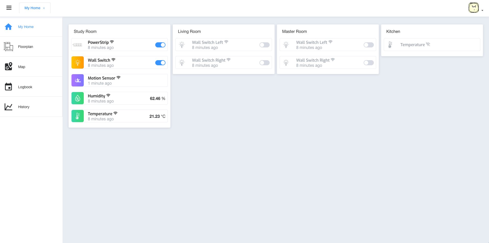

# Homify
Homify is a home automation platform which allows you to control and track all internet devices at home.

The goal of Homify is providing a platform that supports all kind of things from different brands and protocols, enable smart devices to talk to each other and make corresponding interactions.



### Get Started

```
npm run docker
npm run web
npm run gateway

```
Todos: moving eveything to docker

